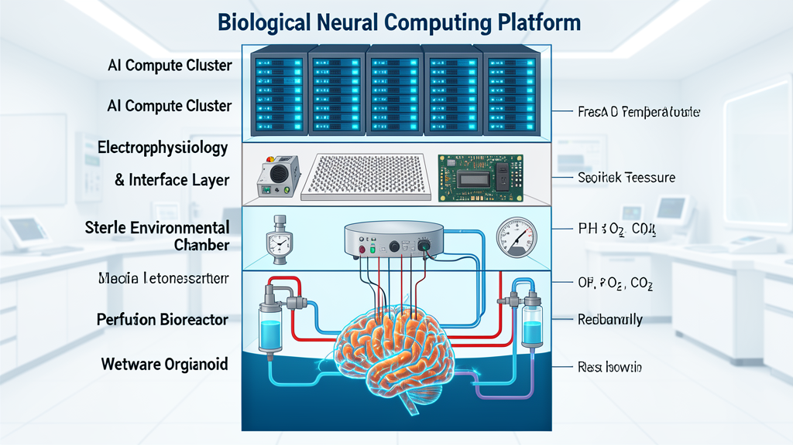

# Wetware Neural Computing Platform



> A research-grade architecture for biological neural computation — living neural tissue (brain organoids / assembloids) interfaced with silicon through closed-loop electrophysiology, perfusion bioreactors, and AI-driven environmental control.

**Status:** Research / Conceptual  
**Privacy:** Private — living neural tissue research requires ethical review before physical implementation.

---

## Research Context

This architecture distills findings from active research programs (Cortical Labs CL1, FinalSpark Neuroplatform, Brain-on-a-Chip reviews 2025, Organoid Intelligence literature) plus the broader field of wetware computing, organ-on-chip platforms, and brain-computer interfaces.

### Active platforms (2024–2025)
| Platform | Organization | Key Feature |
|---|---|---|
| **CL1** | Cortical Labs (AU) | Shoebox-sized "biological computer" — lab-grown human neurons + silicon, deployable by standard labs |
| **Neuroplatform** | FinalSpark (CH) | Remote-access organoid array (~10,000 cells/organoid, 4-month lifespan), bio-inspired robotic perception |
| **Brain-on-a-Chip** | Multiple groups | HD-MEA embedded in microfluidic chip — e.g. 360° size-adjustable MEA for cerebral organoids |

### Key research paper
Talavera, Y. & Ulmann, B. (2025). **Brain Organoid Computing – an Overview.** arXiv:2503.19770.  
Covers: characteristics, challenges (lifespan, interfacing, reproducibility, ethics), and potential advantages of organoid-derived computation over silicon.

---

## System Architecture (6 layers)

```
  AI Compute Cluster + FPGA/GPU Controller
                    │
        Electrophysiology & Encoding Layer
                    │
        ┌─────────────────────────┐
        │  Sterile Environmental   │  ←  pressure, temp, gases, humidity, EMI shield
        │  Chamber / Incubator     │
        ├─────────────────────────┤
        │  Perfusion Bioreactor    │  ←  pumps, gas exchanger, sensors, media loop
        │  (artificial circulation)│
        ├─────────────────────────┤
        │  Wetware Neural Module   │
        │  ┌──────────────────┐    │
        │  │ Brain Organoid   │    │  ←  ~10⁴–10⁷ cells, cultured from hPSC
        │  │ + ECM Scaffold   │    │  ←  Matrigel / PEG-fibrin / hydrogel matrix
        │  ├──────────────────┤    │
        │  │ HD-MEA Interface │    │  ←  microelectrode array (recording + stimulation)
        │  └──────────────────┘    │
        └─────────────────────────┘
                    │
               Waste Processing Loop
```

---

## Layer 1 — AI Compute Cluster (never touches tissue)

Runs entirely on conventional silicon.

| Subsystem | Responsibility |
|---|---|
| Neural decoder | Spike sorting → digital signals |
| Neural encoder | Digital → stimulation waveform |
| Digital twin | Predictive model of tissue state |
| Experiment scheduler | Stimulation protocol design & sequencing |
| Sensor fusion | Multimodal health estimation |
| Imaging analysis | Brightfield, OCT, calcium imaging |
| Nutrient optimizer | Media exchange schedule |
| Predictive maintenance | Anomaly detection |

The AI predicts the biological state and adjusts environmental variables before the tissue shows measurable distress.

---

## Layer 2 — Environmental Chamber

Recreates physiological conditions more precisely than a standard incubator.

| Parameter | Target range | Notes |
|---|---|---|
| Temperature | 37.0 °C ± 0.1 | PID-controlled |
| CO₂ | 5% | pH buffering |
| O₂ | 5–21% (tunable) | Hypoxia modelling |
| Humidity | >95% | Evaporation prevention |
| Pressure | ~760 mmHg ± 5 | Hyperbaric tuning optional |
| Vibration | <0.1 μm | Active isolation table |
| EMI shielding | >60 dB | Protects electrophysiology |
| Particulate | ISO Class 5+ | HEPA filtration |

---

## Layer 3 — Perfusion Bioreactor

The "artificial circulatory system" — continuous nutrient/waste exchange replaces static well culture.

```
Reservoir (conditioned media)
       ↓
Pump (peristaltic / syringe, flow-controlled)
       ↓
Gas Exchange Membrane (O₂/CO₂ equilibration)
       ↓
Temperature Control (in-line heat exchanger)
       ↓
Sterile Filter (0.22 µm)
       ↓
Flow Sensors (mass flow + pressure drop)
       ↓
Wetware Chamber (organoid compartment)
       ↓
Waste Collection
       ↓
Biochemical Monitoring (spectroscopy, osmometer, glucose sensor)
       ↓
Media Conditioning (adjustments)
       ↓
Reservoir
```

**Continuous monitoring parameters:**
- Glucose, lactate, glutamine (biochemical)
- pH (7.35–7.45 target)
- Osmolarity (280–310 mOsm/kg)
- DO₂ (dissolved oxygen)
- DCO₂ (dissolved CO₂)
- Flow rate and pressure drop across tissue

---

## Layer 4 — Wetware Neural Module

### Brain Organoid
- Derived from human pluripotent stem cells (hPSC/iPSC)
- 3D self-organized neural tissue — ~200 µm to 3 mm diameter
- Neuron / glia ratio ≈ 70/30 (mature organoids)
- Spontaneous electrical activity after ~6–8 weeks
- Characteristic electrophysiological signatures: spontaneous bursts, propagating waves

### Artificial ECM Scaffold
Biomaterial matrix providing:
- Mechanical anchoring (prevents shear in perfusion)
- Biochemical signaling (laminin, fibronectin, RGD peptides)
- Axonal guidance (directional porosity)
- Electrical coupling (conductive hydrogels under study)

### HD-MEA Interface
| Feature | Specification |
|---|---|
| Electrode geometry | 10–30 µm diameter |
| Pitch density | 10–42 µm (CMOS MEA) |
| Channel count | 4,096 – 262,000+ per array |
| Recording bandwidth | 0.1 Hz – 20 kHz |
| Stimulation | Bidirectional (biphasic pulse) |

---

## Layer 5 — Electrophysiology + Neural Interface

### Bidirectional signal chain
```
RECORDING (tissue → computer):
  Neuronal spikes → MEA electrodes → ADC amplifier (headstage)
  → band-pass filter → spike sorter (template matching + ML)
  → rate/pattern code → digital bus → AI cluster

STIMULATION (computer → tissue):
  Digital pattern → encoder → DAC → stimulator (biphasic pulse generator)
  → MEA electrodes → depolarization → network response
```

### Key electrophysiological metrics
| Metric | Biological range | Significance |
|---|---|---|
| Spike rate | 0.1–10 Hz (baseline) | Health indicator |
| Burst duration | 100–500 ms | Network synchrony |
| Network synchrony index | 0–1 | Circuit maturation |
| STDP magnitude | ±10–50% | Plasticity active |
| Signal SNR | >3 dB | Interface quality |

---

## Layer 6 — Waste Processing Loop

```
Perfusion outflow (laden with metabolites)
       ↓
0.22 µm filtration (microbe removal)
       ↓
Biochemical analysis (spectrophotometry)
       ↓
Automated adjustments (glucose, amino acids, pH)
       ↓
Volume compensation (osmolarity balance)
       ↓
Fresh conditioned media → reservoir
```

Waste accumulation is the primary mode of functional degradation in long-term cultures; the bioreactor's continuous-loop design targets a steady-state concentration below thresholds that impair synaptic function.

---

## Expected Computational Properties

| Property | Silicon (GPU cluster) | Wetware organoid |
|---|---|---|
| Power consumption | 300–700 W/board | ~20 W equivalent (brain-like) |
| Unit operations | Fixed arithmetic | Spike-based, adaptive |
| Parallelism | ~10¹² transistors | ~10⁷ neurons, each ~10³ synapses |
| Learning | Gradient descent | STDP, Hebbian, homeostatic |
| Fault tolerance | Low (bit-fliptolerant) | High (graceful degradation) |
| Latency | 1–10 ns | 1–10 ms |
| Reproducibility | High | Low-medium (current state) |
| Lifespan | 5–10 years | ~100 days (current) |

---

## Key Research Challenges (as of 2025)

### Solved or advancing
- ✓ Organoid generation from iPSC (routine in many labs)
- ✓ HD-MEA recording from organoids (multiple commercial systems)
- ✓ Closed-loop stimulation protocols demonstrated
- ✓ Remote cloud access platforms (Neuroplatform, CL1)

### Open problems
- **Reproducibility:** Organoid-to-organoid variability is high; identical inputs ≠ identical outputs
- **Lifespan:** Mature neurons form, but cultures degrade after 3–6 months
- **Scalability:** Single organoid interfaces (M EA ~10,000 channels). Scaling to millions requires multiplexed addressing or 3D electrode probes
- **Standard benchmarks:** No agreed task suite for comparing organoid compute performance
- **Ethical governance:** Status of sentience-precursor tissue, consent frameworks for human-derived cells, regulatory path unclear

---

## Modular Rack Concept (lab-scale)

```
CONTROL RACK
├── AI/FPGA compute nodes
├── Data acquisition (Open Ephys / Intan)
├── Imaging (2P / light-sheet)
└── Power & network

       ↓

LIFE-SUPPORT RACK
├── Perfusion pump arrays
├── Gas exchanger modules
├── Environmental control (PID loops)
└── Sensor fusion module

       ↓

WETWARE RACK
├── Chamber 1 (Organoid A)
├── Chamber 2 (Organoid B)
├── Chamber 3 (Organoid C)
└── Chamber N (array expansion)
```

Each chamber is independently addressable — allows parallel experimentation with different cell lines or stimulation protocols.

---

## Project Structure

```
wetware-computing-platform/
├── README.md                    ← this file
├── SOURCES.md                   ← citations and references
├── images/
│   └── architecture.png         ← system diagram (AI-generated)
└── docs/
    ├── architecture.md          ← detailed layer-by-layer breakdown
    ├── electrophysiology.md     ← MEA signal chain deep-dive
    ├── bioreactor.md            ← perfusion loop design
    └── research-gaps.md         ← open challenges & roadmap
```

---

## Disclaimer

This project is a **research conceptualization and educational resource**. It does not provide instructions for constructing or operating living neural tissue culture systems. Implementation of any wetware computing system requires:
- Institutional biosafety committee (IBC) approval
- Ethics board review for human-derived tissue
- Adequate containment (BSL-2 facility for many cell lines)
- Qualified personnel with cell culture and electrophysiology expertise

---

*Generated with research conducted July 2025. Drawing on: arXiv:2503.19770, Cortical Labs CL1, FinalSpark Neuroplatform, Frontiers in Bioengineering 2025, PMC12412539, PMC12938774.*
